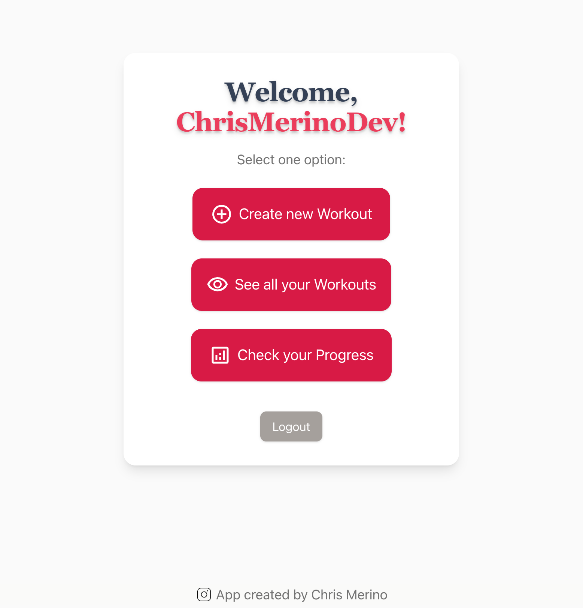
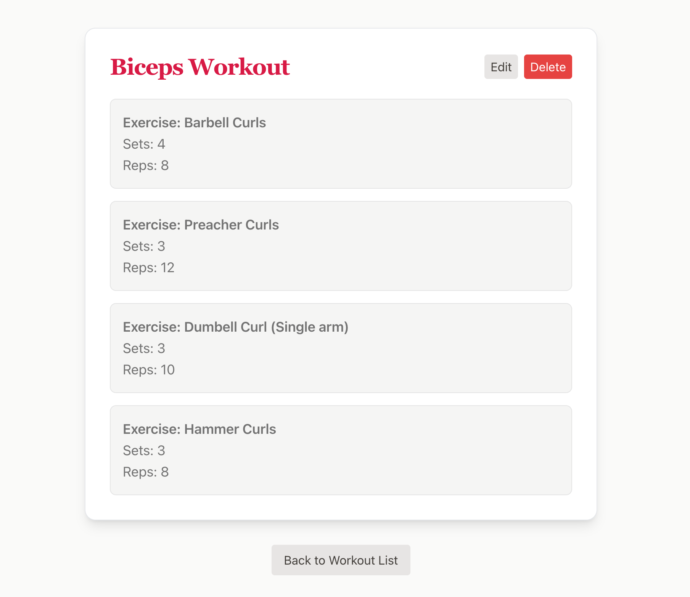

# 🏋️‍♂️ FitTrakr

**FitTrakr** is a full-stack fitness tracking app that helps users build, manage, and track their workouts in real-time. Designed for simplicity and functionality, the app includes authentication, progress tracking, and responsive design.

## 🌐 Live Demo

👉 [Live on Vercel](https://fit-trakr.vercel.app)

---

## 📸 Previews

| Dashboard                         | Workout Detail                          |
| --------------------------------- | --------------------------------------- |
|  |  |

---

## ⚙️ Features

- 🔐 **User Authentication** – Sign up, log in, and log out with secure JWT-based sessions.
- 🏋️ **Workout CRUD** – Create, view, edit, and delete custom workouts.
- 📈 **Progress Summary** – Track total workouts created and your latest one.
- ✅ **Form Validation** – Real-time Zod validation with user feedback on sign-up and login.
- 📱 **Mobile-Responsive** – Clean and minimal UI that works on all devices.
- ☁️ **Vercel Deployment** – Seamless deployment using Next.js App Router.

---

## 🛠 Tech Stack

| Frontend                | Backend    | Validation | Auth          | Database           | Deployment |
| ----------------------- | ---------- | ---------- | ------------- | ------------------ | ---------- |
| Next.js 15 (App Router) | API Routes | Zod        | JWT + Cookies | MongoDB (Mongoose) | Vercel     |

---

## 📂 Project Structure

```
.
├── README.md
├── components.json
├── constants
│   └── routes.ts
├── eslint.config.mjs
├── lib
│   ├── auth.ts
│   ├── hash.ts
│   ├── mongoose.ts
│   └── validations
│       └── index.ts
├── models
│   ├── user.model.ts
│   └── workout.model.ts
├── next-env.d.ts
├── next.config.ts
├── package-lock.json
├── package.json
├── postcss.config.mjs
├── public
│   ├── Icons
│   │   ├── Add.svg
│   │   ├── Add2.svg
│   │   ├── Exercise.svg
│   │   ├── Exercise2.svg
│   │   ├── IGICON.svg
│   │   ├── IGICON2.svg
│   │   ├── Progress.svg
│   │   ├── Progress2.svg
│   │   └── SeeWorkouts.svg
│   ├── file.svg
│   ├── globe.svg
│   ├── next.svg
│   ├── preview-dashboard.png
│   ├── preview-workout-details.png
│   ├── vercel.svg
│   └── window.svg
├── src
│   ├── app
│   │   ├── api
│   │   ├── dashboard
│   │   ├── globals.css
│   │   ├── layout.tsx
│   │   ├── login
│   │   ├── page.tsx
│   │   ├── sign-up
│   │   └── workouts
│   ├── components
│   │   ├── AddWorkout.tsx
│   │   ├── LogoutButton.tsx
│   │   ├── ProgressCheck.tsx
│   │   ├── SeeWorkouts.tsx
│   │   ├── Trademark.tsx
│   │   └── ui
│   ├── lib
│   │   └── utils.ts
│   └── types
│       └── index.ts
├── structure.txt
└── tsconfig.json
```

---

## 💠 Local Development

1. **Clone the repo**

```bash
git clone https://github.com/ChrisMerinoDev/fit-trakr.git
cd fit-trakr
```

2. **Install dependencies**

```bash
npm install
```

3. **Set environment variables**
   Create a `.env.local` file:

```env
MONGODB_URI=your_mongo_uri
JWT_SECRET=your_jwt_secret
NEXT_PUBLIC_BASE_URL=http://localhost:3000
```

4. **Run the dev server**

```bash
npm run dev
```

---

## ✅ Upcoming Improvements

- Dashboard stats and analytics
- Social sharing of workouts
- Dark mode toggle

---

## 📄 License

This project is licensed under the MIT License. © 2025 Chris Merino
